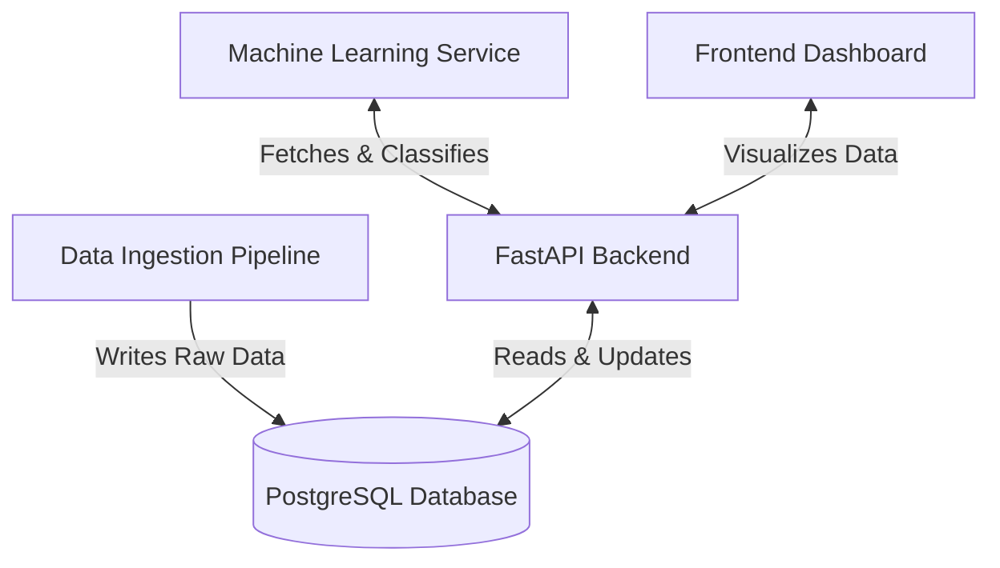

# 🌪️ Onyx Weather Big Data Platform


Welcome to the **Onyx Weather Big Data Platform**. This project is a comprehensive, full-stack data analytics and machine learning pipeline designed to track, ingest, verify, and visualize real-time weather events across India using crowdsourced data, social media, and official meteorological reports.

---

## 🏗️ Architecture Overview

The Onyx ecosystem is divided into four main pillars, communicating through a central PostgreSQL database.



### 1. Data Ingestion (`/data`)
A continuous collection engine that pulls real-time weather information from public sources (Open-Meteo, Mastodon, RSS feeds, and Citizen reports).
- **Status:** Built (currently configured for SQLite, needs to be pointed to PostgreSQL).
- **Core task:** Normalizes raw data, assigns a preliminary "guess" for event categories, and writes it directly to the database. 
- *See [Data Pipeline README](./data/ingestion_pipeline/README.md) for details.*

### 2. FastAPI Backend (`/backend`)
The central nervous system of the platform. It provides REST APIs for the Frontend to consume and the Machine Learning service to use for updating verification statuses.
- **Status:** Built & Ready.
- **Core task:** Serves paginated weather reports, analytics endpoints, and provides admin routes for manual verification. 
- *See [Backend README](./backend/README.md) for details.*

### 3. Machine Learning (`/models`)
*To be implemented.* This service will fetch pending unverified reports from the backend (`GET /api/v1/ml/pending`), analyze the text and media for duplicate/fake detection, and push predictions back to the backend (`POST /api/v1/ml/predictions`).
- **Status:** Placeholder.

### 4. Frontend Dashboard (`/frontend`)
*To be implemented.* A React/Next.js interface for admins and users to view real-time weather events on a map, filter by verified status, and submit citizen reports.
- **Status:** Placeholder.

---

## 🚀 Getting Started

If you are joining the team, here is how you can get the core systems running on your local machine.

### Prerequisites
- Python 3.9+
- PostgreSQL installed and running (or a Cloud Database URL like Supabase/Render)

### 1️⃣ Setting up the Backend
1. Open a terminal and navigate to the backend directory:
   ```bash
   cd backend
   ```
2. Create and activate a virtual environment:
   ```bash
   python -m venv venv
   # Windows:
   venv\Scripts\activate
   # macOS/Linux:
   source venv/bin/activate
   ```
3. Install dependencies:
   ```bash
   pip install -r requirements.txt
   ```
4. Setup your Environment Variables:
   - Duplicate `backend/.env.example` and rename it to `backend/.env`.
   - Update `DATABASE_URL` with your PostgreSQL connection string. *(Note: If you want to share data with the rest of the team, use the team's Cloud Database URL instead of localhost).*
5. Run the Database Migrations:
   ```bash
   alembic upgrade head
   ```
6. Start the Server:
   ```bash
   uvicorn main:app --reload
   ```
   *The API will be available at http://localhost:8000. View the Swagger docs at http://localhost:8000/docs.*

### 2️⃣ Running the Data Ingestion
1. Open a new terminal and navigate to the ingestion pipeline:
   ```bash
   cd data/ingestion_pipeline
   ```
2. Set up the virtual environment:
   ```bash
   python -m venv .venv
   .venv\Scripts\activate
   ```
3. Install dependencies:
   ```bash
   pip install -r requirements.txt
   ```
4. Fetch Data:
   ```bash
   python main.py fetch
   ```

---

## 🤝 Contributing & Git Workflow

- **Never commit `.env` files.** They contain sensitive passwords and API keys. We have already configured `.gitignore` to prevent this.
- **Branching:** When building a new feature (e.g., the frontend or ML service), create a new branch from `main` (e.g., `git checkout -b frontend_dashboard`).
- **Database:** For seamless team collaboration, we highly recommend using a shared cloud database (like Supabase) so everyone is looking at the same data.

---
*Built for the Onyx Hackathon.*
